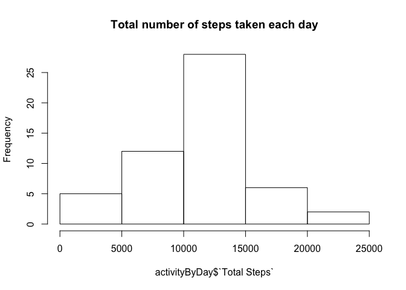
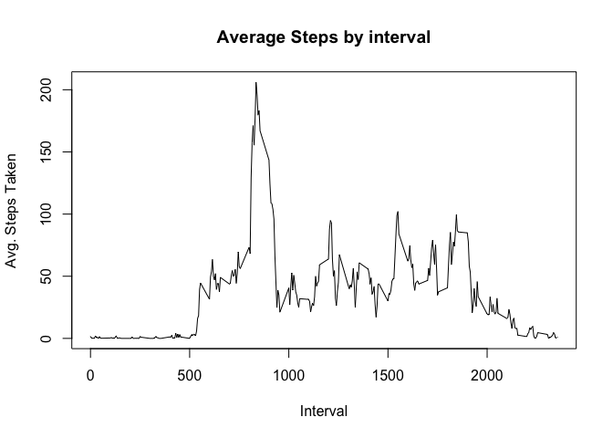
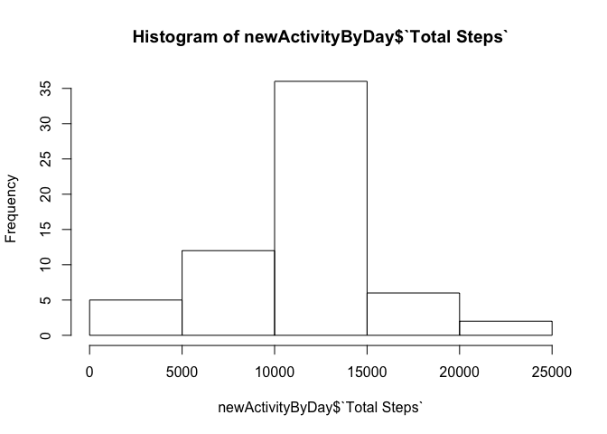
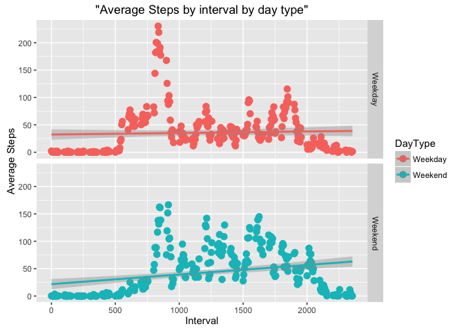

# Reproducible Research: Peer Assessment 1


## Loading and preprocessing the data

Below code reads the data that is extracted into data folder and recreates "activityEdited" object after remobing missing values.


```r
activity <- read.csv("data/activity.csv")
naLogical <- !is.na(activity$steps)
activityEdited <- activity[naLogical,]
```


## What is mean total number of steps taken per day?

Below code stores the steps taken per day in "activityByDay" object and creates a histogram.


```r
activityByDay <- aggregate(activityEdited$steps,list(activityEdited$date), sum)
names(activityByDay) <- c("Date", "Total Steps")

hist(activityByDay$`Total Steps`, main="Total number of steps taken each day")
```



```r
summary(activityByDay$`Total Steps`)
```

```
##    Min. 1st Qu.  Median    Mean 3rd Qu.    Max. 
##      41    8841   10760   10770   13290   21190
```


The summary command above shows that the median of total number of steps taken each day is 10760 and the mean is 10770.

## What is the average daily activity pattern?

Below code and graph shows the average daily activity pattern.


```r
activityByInterval <- aggregate(activityEdited$steps, list(activityEdited$interval), mean)
names(activityByInterval) <- c("Interval", "Avg. Steps")

plot(activityByInterval$Interval,activityByInterval$`Avg. Steps`,type = "l",xlab="Interval",ylab="Avg. Steps Taken")
title(main = "Average Steps by interval")
```



```r
which.max(activityByInterval$`Avg. Steps`)
```

```
## [1] 104
```

```r
activityByInterval[104,]
```

```
##     Interval Avg. Steps
## 104      835   206.1698
```

Max. average steps in in the interval 835

## Imputing missing values

One way of inputting missing values is by including interval level average in that interval. The interval level values are present in activityByInterval and the same values are used below to merge into new activity set.


```r
activityMerged <- merge(activity,activityByInterval,by.x = "interval", by.y="Interval")

activityMerged[is.na(activityMerged$steps),2] <- activityMerged[is.na(activityMerged$steps),4]

newActivitySet <- activityMerged

newActivityByDay <- aggregate(newActivitySet$steps,list(newActivitySet$date), sum)
names(newActivityByDay) <- c("Date", "Total Steps")
summary(newActivityByDay$`Total Steps`)
```

```
##    Min. 1st Qu.  Median    Mean 3rd Qu.    Max. 
##      41    9819   10770   10770   12810   21190
```

After inputting the missing values the median and mean are same and the value is 10770.


```r
hist(newActivityByDay$`Total Steps`)
```


## Are there differences in activity patterns between weekdays and weekends?


```r
newActivitySet <- cbind(newActivitySet,weekdays(as.POSIXlt(newActivitySet$date)),"Weekend")

names(newActivitySet) <- c("Interval",  "Steps","Date","AvgSteps", "WeekDay","DayType")

newActivitySet$DayType <- as.character(newActivitySet$DayType)

newActivitySet[newActivitySet$WeekDay != "Sunday" & newActivitySet$WeekDay !="Saturday", 6] <- "Weekday"

newActivitySet$DayType <- as.factor(newActivitySet$DayType)

newActivitySetByInterval <- aggregate(newActivitySet$Steps, list(newActivitySet$Interval, newActivitySet$DayType), mean)

names(newActivitySetByInterval)  <- c("Interval", "DayType", "Average")

library(ggplot2)
```

```
## Warning: package 'ggplot2' was built under R version 3.2.3
```

```r
ggplot(newActivitySetByInterval, mapping = aes(Interval,Average, col = DayType,title='Average Steps by interval by day type')) +
  ylab("Average Steps") +
  geom_point(size=3)+ geom_smooth(method="lm") + facet_grid(facets = DayType~.)
```




The above graph shows the weekday and weekend have different trends during the day.
